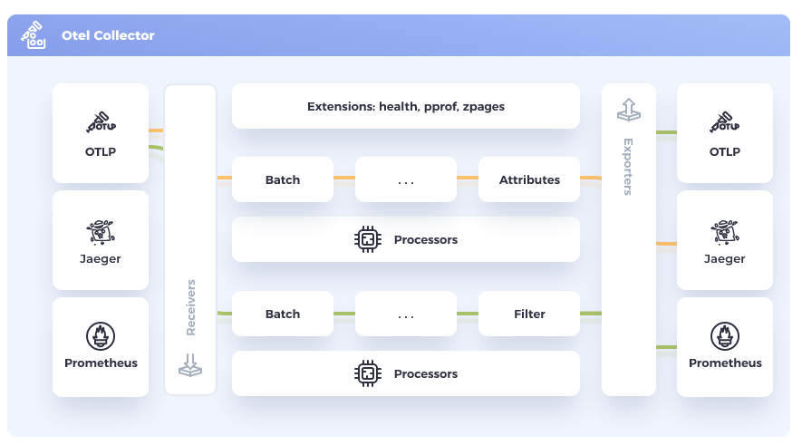

# OpenTelemetry Collector introduction

### Collector Overview


> Vendor-agnostic way to receive, process and export telemetry data.

The OpenTelemetry Collector can be devided into a few major parts.

- receiver -> active or passive component
- proccessor -> does something
- exporter -> translates otlp into something
- extensions -> auth stuff and others

More details [here](https://opentelemetry.io/docs/collector/)

## Collector Distributions

Since there are so many collector parts, you may wonder if

### OpenTelemetry Collector Builder (OCB)

```yaml
receivers:
  - import: go.opentelemetry.io/collector/receiver/otlpreceiver
    gomod: go.opentelemetry.io/collector v0.57.2

exporters:
  - import: go.opentelemetry.io/collector/exporter/otlpexporter
    gomod: go.opentelemetry.io/collector v0.57.2
  - import: go.opentelemetry.io/collector/exporter/loggingexporter
    gomod: go.opentelemetry.io/collector v0.57.2
```

https://github.com/open-telemetry/opentelemetry-collector-releases/blob/v0.75.0/distributions/otelcol/manifest.yaml
https://github.com/open-telemetry/opentelemetry-collector-releases/blob/v0.75.0/distributions/otelcol-contrib/manifest.yaml

https://opentelemetry.io/blog/2022/collector-builder-sample/

### Offical distributions
There are two collector distributions: "core" and "contrib":

* "core" - https://github.com/open-telemetry/opentelemetry-collector
* "contrib" - https://github.com/open-telemetry/opentelemetry-collector-contrib


https://github.com/open-telemetry/opentelemetry-collector-releases
Every 2 Weeks new release - Collector images are published to the Github container registry https://github.com/orgs/open-telemetry/packages?repo_name=opentelemetry-collector-releases.

## Configuration

```yaml
receivers:
  otlp:
    protocols:
      grpc:
        endpoint: 127.0.0.1:4317
processors:
  batch:

exporters:
  logging:
    verbosity: detailed

service:
  pipelines:
    metrics:
      receivers: [otlp]
      processors: [batch]
      exporters: [logging]
    logs:
      receivers: [otlp]
      processors: [batch]
      exporters: [logging]
    traces:
      receivers: [otlp]
      processors: [batch]
      exporters: [logging]
```

```bash
curl -k -s https://abc.de > collector-config.yaml
```

## Run collector locally

```bash
docker run --rm -it --network=host -v ${PWD}/collector-config.yaml:/tmp/collector-config.yaml:z ghcr.io/open-telemetry/opentelemetry-collector-releases/opentelemetry-collector:0.74.0 --config /tmp/collector-config.yaml
```

### Send telemetry data to your Collector

```bash
telemetrygen metrics --otlp-insecure --duration 10s --rate 4
# or
telemetrygen logs --otlp-insecure --duration 10s --rate 4
# or
telemetrygen traces --otlp-insecure --duration 10s --rate 4
```

---

### Run your OpenTelemetry Collector on Kubernetes

Learn more: [OpenTelemetry Operator introduction](./02-operator-introduction.md)
